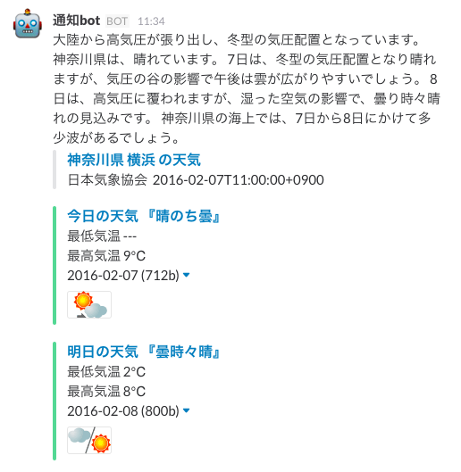

# slack-weather-notifier

Notify weather on Tokyo to Slack.

<!--  -->

## Usage

```shell
git clone git@github.com:kohei-kimura/slack-weather-notifier.git
cd slack-weather-notifier
export SLACK_WEBHOOK_PR="your team webhook url"
ruby slack-weather-notifier.rb
```
